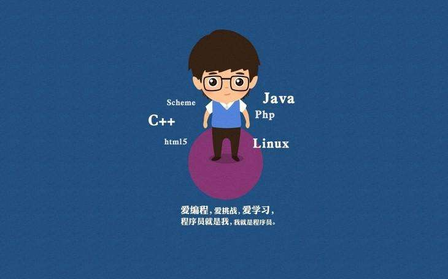

# Java开发的奇淫巧技

## 🔥 动态执行Java代码

通过 JavaCodeEval 实现动态编译执行Java代码  [了解更多](./dynamic_compile/README.md)

## 🔥 自定义类加载器

类加载器是JVM一个非常重要的内容，我们可以通过自定义类加载器实现从网络中加载class。[了解更多](./class_loader/README.md)

## 🔥 反序列化多态类型

著名的Json 库 JackSon 特性支持多态反序列化, 可以根据接送类型的某个字段值来反序列化到不同的子类中，实现动态序列化 [了解更多](./jackson/README.md)

