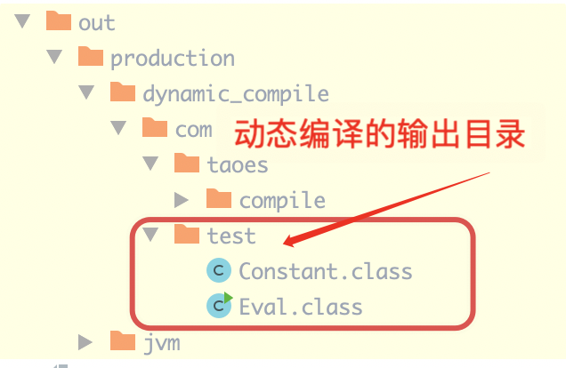

# 动态执行Java代码

+ 核心实现 ` JavaCompiler javaCompiler = ToolProvider.getSystemJavaCompiler();`
+ 类加载器的实现

```java

package com.taoes.compile;

public class JavaCodeEval implements Compile {

    @Override
    public List<Class> process(List<ClassSource> classSourcesList) throws IOException {
        // 获取系统编译器
        JavaCompiler javaCompiler = ToolProvider.getSystemJavaCompiler();

        // 获取文件管理器
        StandardJavaFileManager standardFileManager = javaCompiler.getStandardFileManager(null, null, null);

        Iterable<? extends SimpleJavaFileObject> javaObjects = classSourcesList.stream().map(ClassSource::toStringJavaObject).collect(Collectors.toList());

        // 构建编译输出目录
        String outDir = null;
        try {
            File file = new File(Objects.requireNonNull(Thread.currentThread().getContextClassLoader().getResource("")).toURI());
            outDir = file.getAbsolutePath() + File.separator;
        } catch (URISyntaxException e) {
            e.printStackTrace();
        }

        // 构建编译选项
        Iterable<String> optional = Arrays.asList("-d", outDir);
        JavaCompiler.CompilationTask task = javaCompiler.getTask(null, standardFileManager, null, optional, null, javaObjects);

        // 执行编译
        if (task.call()) {
            try {
                // 遍历加载类到方法区
                List<Class> classList = new ArrayList<>(classSourcesList.size());
                for (ClassSource classSource : classSourcesList) {
                    String className = classSource.getClassName();
                    Class<?> aClass = Class.forName(className);
                    classList.add(aClass);
                }
                return classList;
            } catch (Exception e) {
                e.printStackTrace();
                throw new RuntimeException(e);
            }
        }
        return null;
    }
}

```


+ 编译出的class文件




